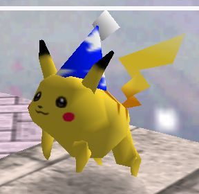
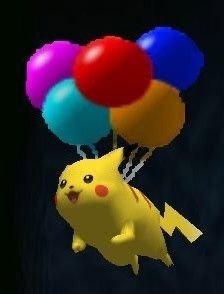

## Main 

Hope's CSSE Blog! Thank you for visiting.

 

## Links 
A straightforward way to find important sites without struggle. Isn't that nice? Having something right in front of you without needing to go through millions of pages trying to find it? You're welcome.

    
    
     

 

## Extras 

Images (of pikachu) to relate to:

